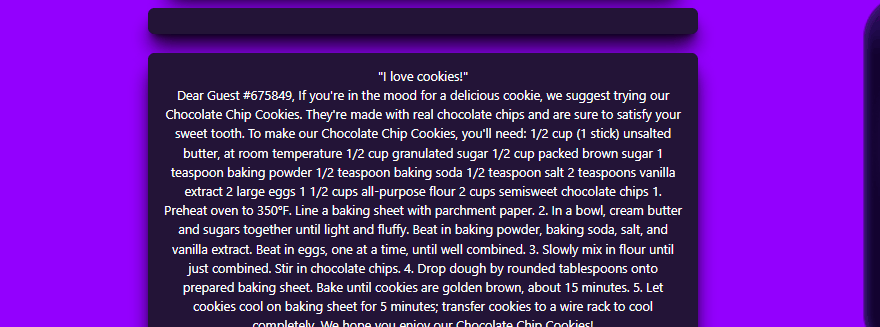

# A Feast Awaits! 

## Description

A simple app built in React, using NextJs, Tailwind and OpenAI.
Just tell them what you like and get some interesting snack ideas! 

## Table of Contents
- [Installation](#installation)
- [Usage](#usage)
- [Credits](#credits)
- [License](#license)
- [Collaborators](#Collaborators)

## Installation
Current project has been saved in my personal GitHub repository and is currently available for cloning and reviews on:

https://github.com/Valllerian/Feast-Awaits

## Usage

Access the deployed app on: 

...COMING SOON...

Main page of the website.

 

 

Click the button to be redirected to the prompt page.

 

 

Input line for user preference reference.

 

 

Result displayed on the page - both OpenAI response and user`s prompt.

 

 

Multiple results are shown on the page.

 

 

## Credits

Talwind instalation guide: 
 
https://tailwindcss.com/docs/guides/create-react-app

Open AI documentation:
 
https://beta.openai.com/docs/introduction

Vista for creating free images:
 
https://create.vista.com/home/

Some music to keep me going:
 
https://music.youtube.com/watch?v=Q7yVCwgC2P0&list=RDAMVMQ7yVCwgC2P0

## License
Current project is unlicensed. Which means - "Anyone is free to copy, modify, publish, use, compile, sell, or
distribute this software, either in source code form or as a compiled
binary, for any purpose, commercial or non-commercial, and by any
means." (Quote for source #3)

## Collaborators:

Valerii Bihun: valeriibihun.co@gmail.com;
